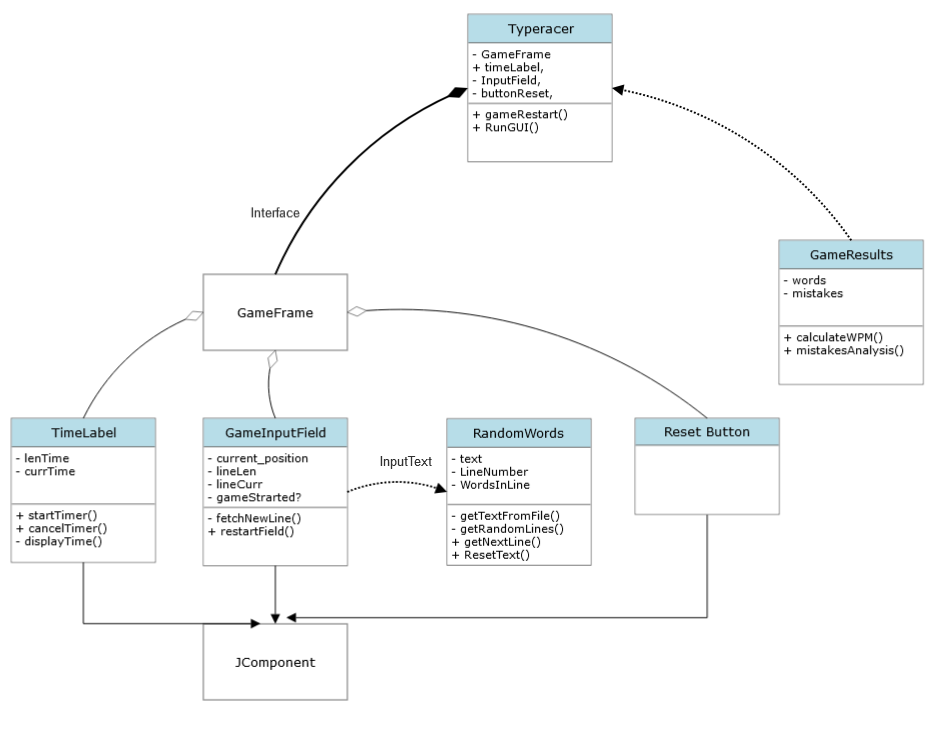
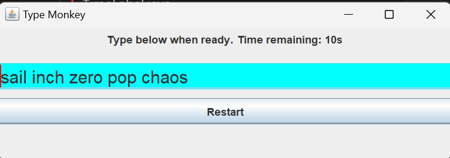

- Java Project using SWING library for 2023 Summer University course "OOP".
- Project is a simple Typing game whose aim is to assess users typing performance, speed and accuracy.
- By default runs for 10s. You can specify game time length in command line.
- Game has been tested both on Linux (Ubuntu + Fedora) and Windows 11.
- For Linux use 
    - cd ./src/main/java/
    - "make" to compile or "make run" to both compile and run program.
- For Windows use "ming32-make make" and "ming32-make run" respectively.
    For example: "make run TIME=60"
- Projects only requirement is Java 11.
- Projects Class Diagram:

- Project demo:
 

